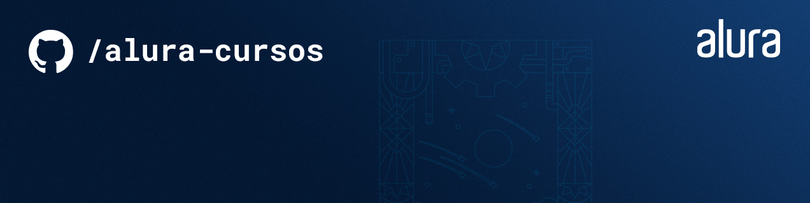
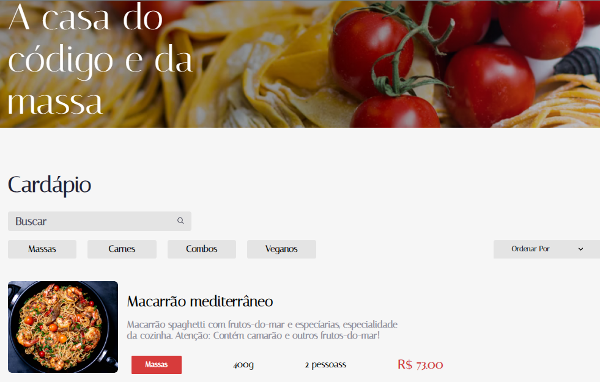

  

  

Este projeto teve como sua base as informações disponíveis no Figma e a partir dessas informações foi desenvolvido uma App web, utilizando o React como framework

## Tecnologias utilizadas no projeto
* HTML
* SCSS
* Typescript
* React

## Screenshots

